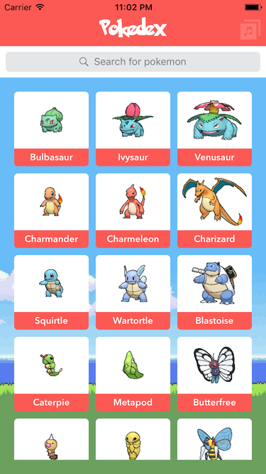
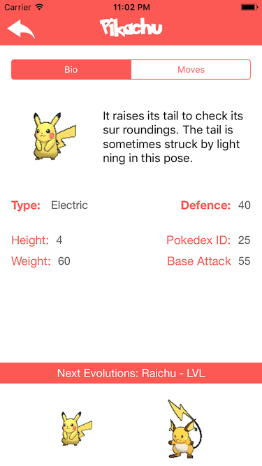

# Pokedex

Source : iOS 10 & Swift 3: From Beginner to Paid Professional (Udemy)

Pokedex is a project used for swift practice and autoLearning

Pokedex App is an app that acts as a pokedex with pokemons of several generations. it shows you an image of the pokemon, and gives you a detail of its personal characteristics

This project uses:

* Auto Layout
* Stack Views
* Collection View
* Custom Collection View Cell
* Closures
* AlamoFire
* Escaping Closures
* Poke Api V1
* Clases
* MVC
* Search Bar
* AV Audio Player
* Segues

